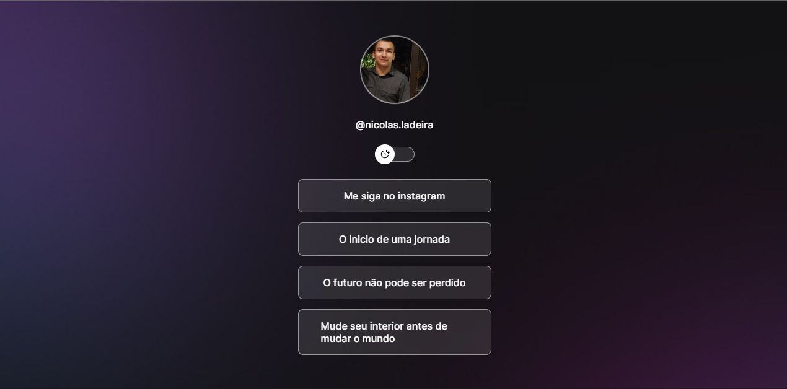

<h1 align="center"> NicolasLinks </h1>

Construí esse projeto com ajuda da <a href= "https://rocketseat.com.br" target= "_blank"> Rocketseat </a> .

  

 

  

## Tecnologias

Esse projeto foi desenvolvido com as seguintes tecnologias:

- HTML e CSS
- JavaScript
- Git e Github

## Projeto

Esse projeto é o inicio de toda uma carreira, depois de muito tempo vagando e me perguntando o
que eu poderia fazer para me realizar profissionalmente e dentro da minha vida pessoal, nesses
28 dias de projeto dei meu pontapé inicial dentro da área da programação.

## Licença

Esse projeto está sob a licença MIT.

<h2> Objetivos futuros </h2>
Vou fazer meu roadmap e aprimorar minhas habilidades dentro da programação, buscando qual área me aprimorar dentro de tantas campos nesse vasto mundo tecnológico.
